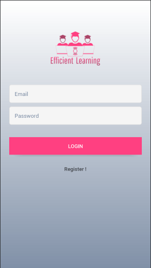
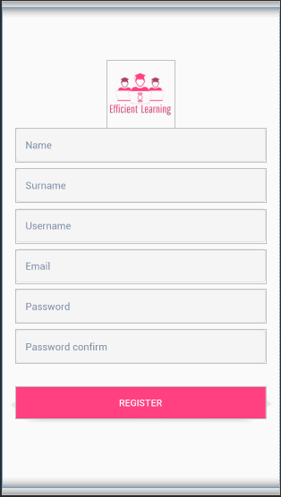
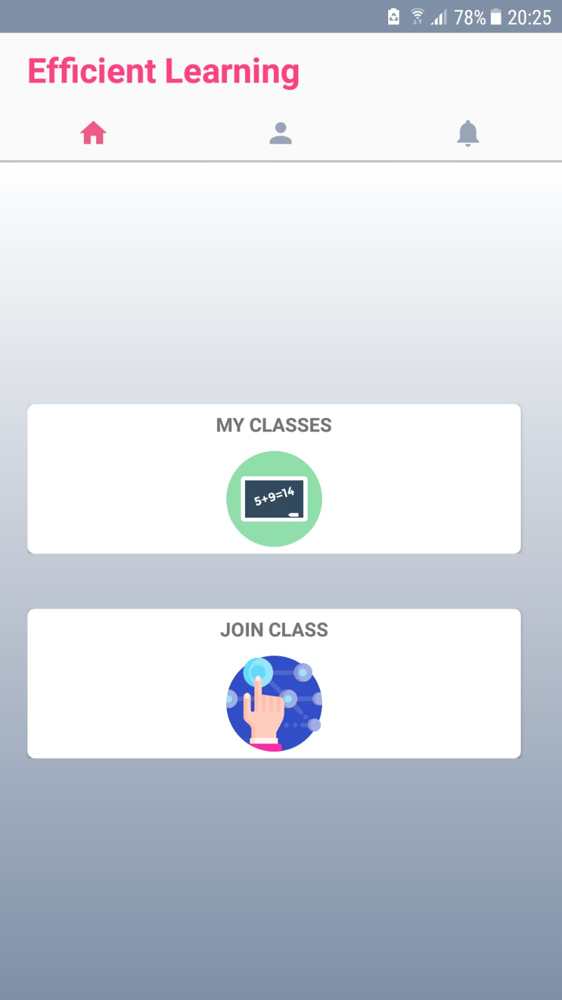
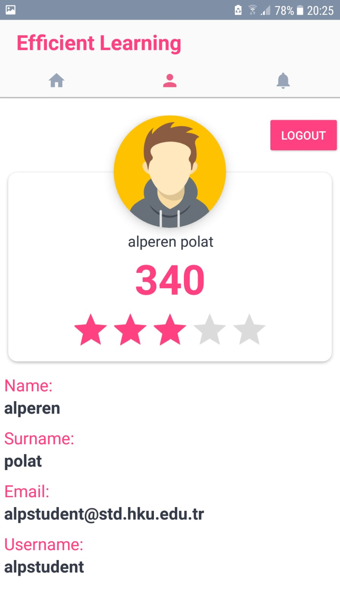

# EfficentLearning
Android Shopping app

This application basically is a school android application, there is 3 roles used in this application.

** the admins can add delete and update : students, teachers and courses. 

** the teachers can list them classes, give homework’s, see the answers made by the students, give notes
For the homework’s for each student.

** student can register to this app, join any class, give answers to teachers questions, see them scots if entered by the teacher.

this app also use notifications for each the teachers and the students to notify them about the classes and homework’s.

This app works with:
1. Retrofit 2.
2. sqlite.

